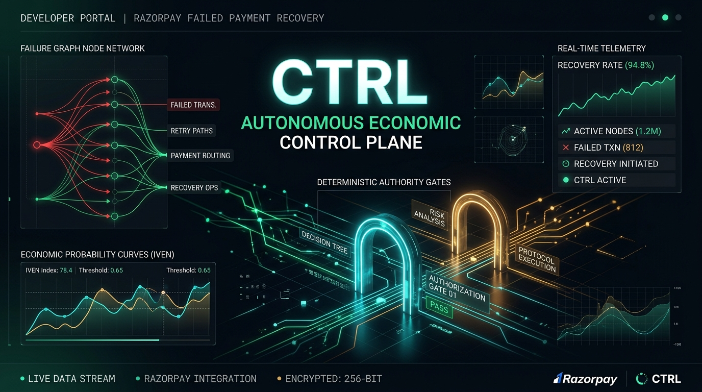
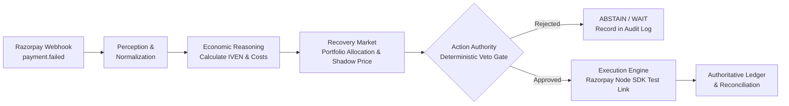

<p align="center">
  
</p>

<h1 align="center">CTRL</h1>

<h3 align="center">
  Autonomous Economic Control Plane for Failed-Payment Recovery on Razorpay
</h3>

<p align="center">
  <em>CTRL doesn't ask "can we recover this payment?" — It asks<br/>
  "is recovering this payment <strong>worth spending our next unit of limited recovery capacity?</strong>"<br/>
  and only acts when the answer survives a deterministic compliance check.</em>
</p>

<p align="center">
  <a href="https://ctrl-recovery.vercel.app/dashboard" target="_blank">
    
  </a>
  <a href="#-quickstart-in-60-seconds">
    
  </a>
  
</p>

---

## 💡 The Core Premise

Payment gateways like Razorpay already excel at smart per-payment retry timing. **CTRL is the layer above it.**

In high-volume commerce, recovery capacity is finite and costly:
- Creating payment links and sending WhatsApp/SMS notifications incurs direct operational fees.
- Aggressive retries cause customer contact fatigue, brand erosion, and support tickets.
- Blind retries waste budget chasing hard declines (stolen cards, invalid accounts) or recovering transactions that the customer was going to re-attempt naturally.

CTRL treats every failed payment as a **Recovery Opportunity** competing against every other opportunity in a portfolio for scarce capacity, resolving to one of three rational decisions:

$$\mathbf{ACT} \quad\vert\quad \mathbf{WAIT} \quad\vert\quad \mathbf{ABSTAIN}$$

---

## 📐 The Economic Engine (IVEN)

CTRL scores opportunities using **Incremental Value of Expected Net-recovery (IVEN)** rather than raw recovery probability:

$$IVEN = (P_{\text{int}} - P_{\text{nat}}) \times \text{Amount} - C_{\text{op}} - C_{\text{fatigue}}$$

| Parameter | Description |
|---|---|
| $P_{\text{nat}}$ | **Model-estimated natural recovery probability** (the counterfactual: will the customer retry and pay on their own?). |
| $P_{\text{int}}$ | **Model-estimated intervention recovery probability** with tailored payment link outreach. |
| $\Delta P = P_{\text{int}} - P_{\text{nat}}$ | **True incremental lift** attributable strictly to intervention. |
| $C_{\text{op}}$ | Direct operational cost (e.g. ₹4.00 Razorpay link overhead, WhatsApp utility fees). |
| $C_{\text{fatigue}}$ | Exponential fatigue penalty as prior attempt count increases. |

> **Principle:** If a ₹5,000 transaction has a 92% natural recovery probability, intervening only adds 3% incremental lift. A ₹1,200 transaction with 10% natural recovery and 65% intervention probability generates far higher incremental value (+55% lift) and wins priority.

---

## 🏗️ Architecture Pipeline



### The Two-Stage Guarantee
1. **Economic Optimization:** Portfolio-level greedy allocation under capacity limits (e.g. max 5 payment links per batch run). The marginal accepted value defines the system **Shadow Price ($\lambda$)**.
2. **Deterministic Action Authority:** A strict, non-economic compliance gate evaluates:
   - Hard decline codes (`payment_failed_card_lost`, fraud) $\rightarrow$ immediate `ABSTAIN`.
   - Retry ceiling limits (max 3 attempts).
   - Global or tenant kill switches.
   - Contact fatigue backoff limits.

---

## 🛡️ Non-Negotiable System Invariants

1. **Zero LLMs on Execution Path:** No language model decides an action, writes a monetary value, or creates a payment link. LLMs are strictly optional for human natural-language explanations.
2. **Razorpay Test Mode Only:** CTRL runs against official Razorpay Test Mode keys (`rzp_test_...`). No claims of live-money execution are made anywhere.
3. **5% Counterfactual Holdout:** 5% of eligible opportunities are deterministically held out in an uncontacted control group to measure true empirical natural recovery rates without survival bias.
4. **Append-Only Durability:** Every state transition and decision rationale is permanently logged to SQLite / Supabase tables before execution starts.

---

## 🚀 Quickstart in 60 Seconds

### Prerequisites
- Node.js 20+
- Razorpay Test Key ID & Secret ([dashboard.razorpay.com](https://dashboard.razorpay.com))

### 1. Installation
```bash
git clone https://github.com/Mr-Roninx/CTRL.git
cd CTRL
npm install
cd frontend && npm install && cd ..
```

### 2. Configure Environment
```bash
cp .env.example .env
```
Add your Razorpay test credentials in `.env`:
```env
RAZORPAY_KEY_ID=rzp_test_your_key_id
RAZORPAY_KEY_SECRET=your_test_secret
RAZORPAY_WEBHOOK_SECRET=rzp_whsec_ctrl_test
```

### 3. Run Real End-to-End Recovery Proof
Execute the end-to-end verification script to ingest a failed payment, compute IVEN, allocate capacity, pass the compliance gate, and generate a **real Razorpay hosted payment link**:
```bash
npm run demo:e2e
```

Sample output:
```text
⚡ CTRL — END-TO-END AUTONOMOUS RECOVERY PROOF (REAL RAZORPAY TEST MODE)
--- Step 1: Ingesting Failed Payment Event [₹1,850.00 | Reason: INSUFFICIENT_FUNDS]
--- Step 2: Economic Score: ΔP = +20.0%, IVEN = ₹366.00
--- Step 3: Portfolio Allocation: Decision = ACT (Rank #1, Shadow Price = ₹0.00)
--- Step 4: Action Authority: 5/5 Deterministic Checks PASSED
--- Step 5: Calling Official Razorpay Node SDK...
✅ REAL RAZORPAY PAYMENT LINK GENERATED!
   Razorpay Link ID: plink_Tblpdrj8U5dM8g
   Hosted URL:       https://rzp.io/rzp/e6lTjKBI
--- Step 6: Direct Provider API Fetch Verified Status: created
--- Step 7: Reconciled into Double-Entry Ledger
🎉 END-TO-END RECOVERY PROOF COMPLETED SUCCESSFULLY!
```

### 4. Start Development Servers
```bash
# Terminal 1: Backend API
npm run dev

# Terminal 2: Frontend Dashboard
cd frontend && npm run dev
```
Open **[http://localhost:3000/dashboard](http://localhost:3000/dashboard)** in your browser.

---

## 📊 Core Data Schema

| Entity | Purpose |
|---|---|
| `RecoveryOpportunity` | Canonical record created from raw `payment.failed` webhooks (`id`, `amount_paise`, `decline_type`, `status`). |
| `Score` | 1:1 economic assessment (`natural_recovery_prob`, `intervention_recovery_prob`, `incremental_prob`, `operational_cost_paise`, `fatigue_cost_paise`, `expected_incremental_value_paise`). |
| `AllocationDecision` | Portfolio batch decision (`ACT`, `WAIT`, `ABSTAIN`), ranking, and `shadow_price_paise_at_decision`. |
| `AuthorityCheck` | Many:1 audit records for each deterministic compliance rule evaluated. |
| `ExecutionRecord` | Result of provider dispatch (`razorpay_payment_link_id`, `link_url`, `idempotency_key`, `created_at`). |
| `LedgerEntry` | Append-only event history (`webhook_received`, `reconciled`, `recovered`, `not_recovered`). |

---

## 🧪 Test Suite

Run the full automated test suite covering tenant isolation, economic calculations, authority gates, and idempotency:
```bash
npm run test:agent
npm run test:authority
npm run test:economics
```

---

## 💬 Author Note

Built for the **Razorpay AI Buildathon**. The project was born from a fundamental observation in payments engineering: *more retries is not always better retries.* By applying marginal economic reasoning to failed transaction recovery, merchants can maximize revenue lift while protecting customer goodwill and operating within strict capacity limits.

**Author:** [Mr-Roninx](https://github.com/Mr-Roninx)  
**License:** MIT
